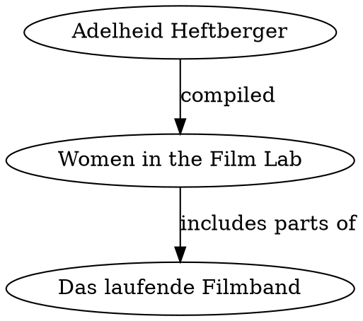
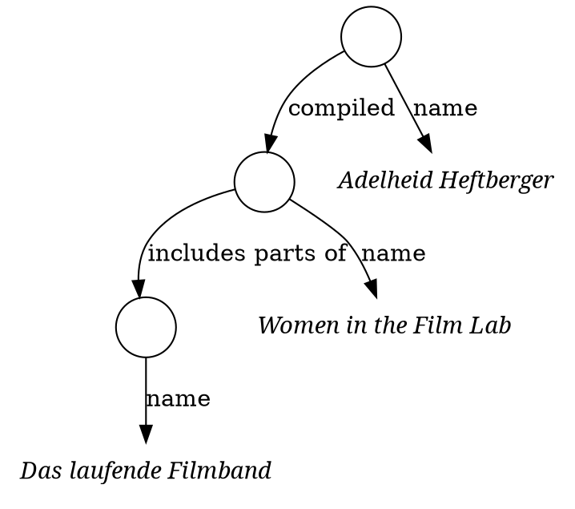
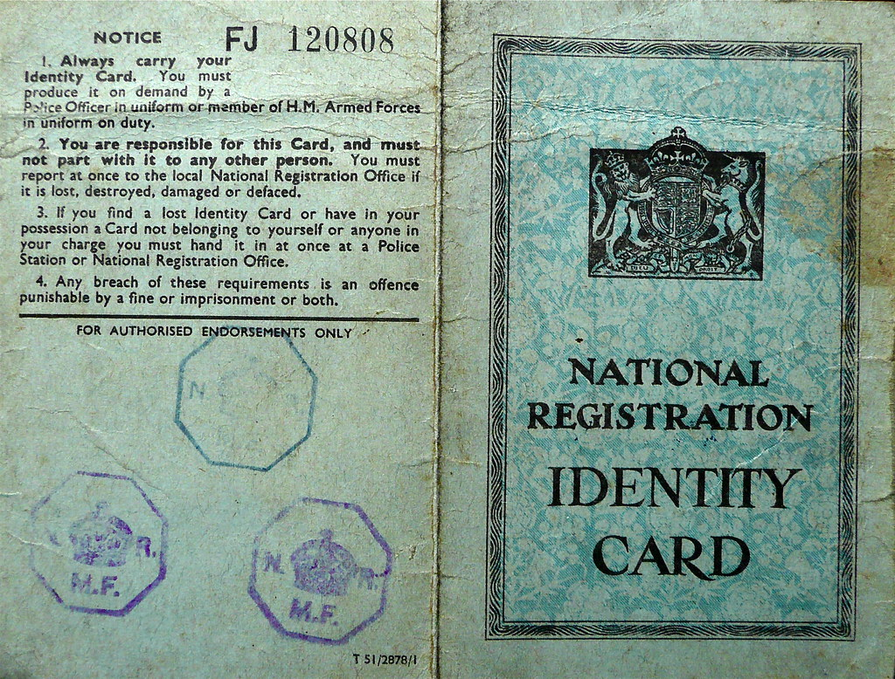

## Questions of this talk

* What are **identifiers** and why are they so important?

* How and why are identifiers organized in **authority files**?

* How and why can identifiers be used to **openly link data**?

* What's **Wikidata** again?

# Example: Women in the Film Lab

---

---

## Identifiers allow to reference things

* *Adelheid Heftberger*:

    * ORCID [0000-0001-7909-6858](https://orcid.org/0000-0001-7909-6858)
    * Wikidata [Q42369365](http://www.wikidata.org/entity/Q42369365)
    * Twitter [\@adelheidh4](https://twitter.com/adelheidh4)
    * ...

* *Women in the Film Lab*:

    * ...?

* *Das laufende Filmband*: 

    * German Federal Archives call numbers \
      `K 248565-2`, `19464-2`, `19547-1`, `19546-1`, `K 246771-1`

    * ...?

These make up **authority files** (aka vocabularies)

## Identifiers allow to reference semantics

Data fields, properties, keys...

* *compiled*

    * `dcterms:creator` (reverse)
    
    * `editor (P98)` (reverse)

    * ...

* *includes parts of*

    * `cito:cites`

    * `has part (P527)`

    * ...?

These make up **ontologies** (special kind of vocabularies)

## Identifiers should have an URI

* ORCID <https://orcid.org/0000-0001-7909-6858>

* Wikidata

    * has part (`P527`) = <http://www.wikidata.org/entity/P527>

    * `Q42369365` = <http://www.wikidata.org/entity/Q42369365>

* RDF Ontologies

    * `dcterms:creator` = <http://purl.org/dc/terms/creator>

    * `cito:cites` = <http://purl.org/spar/cito/cites>

* German Federal Archives call numbers: ?

## First Summary

* Data is about things with properties and connections

* Things (*including people, works, ideas...*)\
  should have identifiers

* Properties (*keys, fields, connection types...*)\
  should have identifiers

* Identifiers should be available in form of URIs

# Identifiers: Why So Serious?

---

{width=100%}

## What's an identifier?

* Artificial name for a thing

* ...(TODO)

## Data and reality

Some problem with names

* Homonyms, synonyms, language

## Identifier requirements

* unique
    * 
* accessible (look-up)
* ...

## Identifier examples

film identifiers:

* [175 Wikidata property to identify films](https://w.wiki/426y)
* people identifiers

## Identifier mapping

Multiple identifiers used for same thing.

"reconciliation", "mapping", "alignment"

...

Tools: OpenRefine, Cocoda, Pen & Paper\
(depending on the type of authority file)

# Authority Files and vocabularies

## Motivation

Identifiers must be organised

...

## Where to find authority files

*Please let us know if you miss some relevant authority files!* 

## Types of Authority files

1. Name Authority files & registries

2. Classification and thesauri

3. Ontologies, data models and formats

## Name Authority files & registries

* Relatively simple to agree on identity
* large number of entities, mostly unconnected\
  e\.g. people, companies, countries
* Required for linking

Example: Databases of people

## Ontologies, data models and formats

* Relatively small
* Complex type of connections possible
* Classes (object types) and properties (fields)
* Used as metadata schema
* Very opiniated, much depens on a use case
* Required for interoperability

Example: FIAF Ontology

## Classification and thesauri

* Can be large or small
* Simple kind of connections (e.g. hierarchy)
* Also opiniated
* Required for overviews

Example: genres, subjects...

# Linked Open Data (LOD)

## Linked Open Data principles

1. Use URIs as names for things.

2. Use HTTP URIs so that people can look up those names.

3. When someone looks up a URI, provide useful information.

4. Include links to other URIs,\
   so that they can discover more things.

\vfill

Berners-Lee (2006): *Linked Data*

## 5 Star Open Data

{width=90%}

Berners-Lee (2010): *Is your Linked Open Data 5 Star?*

## FAIR data principles

* **F**indable

* **A**ccesible

* **I**interoperable

* **R**eusable

\vfill

Wilkinson et al (2016):  *The FAIR Guiding Principles for scientific data management and stewardship*

## Summary in my Jakob's words

* Use stable identifiers for entities you care about\
  (preferred: URIs)

* Allow to look up identifiers\
  (findable & accessible)

* Deliver some useful data\
  (open license, accessible & reusable)

* Use standard vocabularies for identifiers and data formats\
  (interoperable & linked)

# Wikidata revisited

## What's Wikidata?

* An open knowledge base

* A hub of identifiers

* A data playground

* A community of people interested in data

* ...

## Example: *Das laufende Filmband*

* Wikidata item [Q108430283](http://www.wikidata.org/entity/Q108430283)

* labels and statements (optionally with qualifiers and references)

\vfill

Some open questions:

* What is the date of the film?

* Who is director "Willy Zeyn" of the film?

* How to connect with data from German Federal Archives?

## Summary

* identifiers: it's all about explicit identity

* ...

